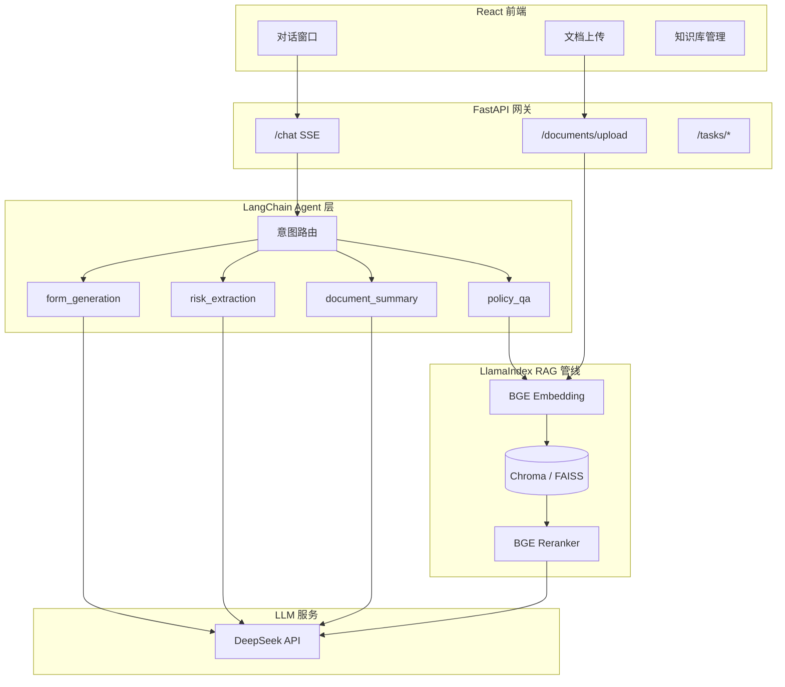
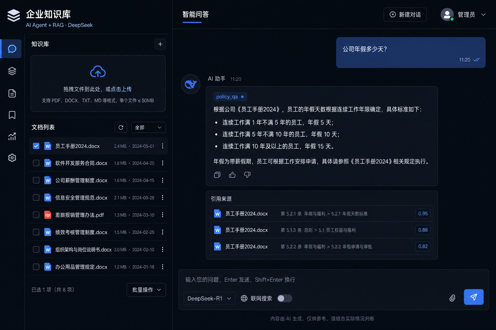

# Enterprise Knowledge Base — AI Agent + RAG

企业级 AI 知识库系统：支持 **PDF / Word / PPT / Excel** 上传，基于 **RAG** 回答制度问题，通过 **Agent 意图路由** 完成合同总结、风险条款提取、请假单生成。

[](https://fastapi.tiangolo.com/)
[](https://react.dev/)
[](https://langchain.com/)
[](https://www.llamaindex.ai/)
[](https://www.deepseek.com/)

## 功能特性

- **多格式文档解析**：PDF、DOCX、PPTX、XLSX 智能分块入库
- **RAG 制度问答**：向量检索 + BGE Rerank，回答带引用溯源
- **Agent 四场景路由**：制度问答 / 合同总结 / 风险抽取 / 请假单生成
- **双向量库**：Chroma（默认持久化）/ FAISS（可配置切换）
- **流式对话**：SSE 实时输出，React 现代 UI

## 系统架构



## 界面预览



| 制度问答 | 合同风险抽取 |
|---------|-------------|
| RAG 检索员工手册，返回年假天数 + 引用来源 | 勾选合同后自动提取不利条款并标注风险等级 |

## 技术栈

| 层级 | 技术 |
|------|------|
| 后端 | FastAPI, SQLAlchemy, SQLite |
| 前端 | React, Vite, TypeScript |
| RAG | LlamaIndex, Chroma, FAISS, BGE Embedding |
| Rerank | BGE-Reranker-v2-m3 (Cross-Encoder) |
| Agent | LangChain + 规则意图路由 |
| LLM | DeepSeek（默认，OpenAI 兼容接口） |

## 快速开始

### 环境要求

- Python 3.10+
- Node.js 18+
- DeepSeek API Key

### 1. 克隆项目

```bash
git clone https://github.com/lyu24944-cmyk/enterprise-kb.git
cd enterprise-kb
```

### 2. 配置 API Key

```bash
copy backend\.env.example backend\.env
# 编辑 backend\.env，填入 DEEPSEEK_API_KEY
```

### 3. 一键启动（Windows）

双击 `运行演示.bat`，或在桌面使用 **「企业知识库」** 快捷方式。

### 4. 手动启动

```bash
# 后端
cd backend
python -m venv .venv
.venv\Scripts\activate
pip install -r requirements.txt
uvicorn app.main:app --reload --port 8000

# 演示数据（新终端）
cd backend && .venv\Scripts\activate
python ..\scripts\seed_demo_docs.py

# 前端（新终端）
cd frontend
npm install
npm run dev
```

访问：

- 前端：http://localhost:5173
- API 文档：http://127.0.0.1:8000/docs
- 健康检查：http://127.0.0.1:8000/health

### Docker 启动

```bash
# 先配置 backend/.env
docker compose up --build
```

- 前端：http://localhost:8080
- 后端：http://localhost:8000

## 演示问题

| 问题 | 意图 | 操作 |
|------|------|------|
| 公司年假多少天？ | `policy_qa` | 直接提问 |
| 总结这份合同内容 | `document_summary` | 勾选「软件开发服务合同」 |
| 帮我提取所有风险条款 | `risk_extraction` | 勾选合同文档 |
| 根据制度生成请假申请 | `form_generation` | 补充日期和事由 |

## RAG 评测

```bash
cd backend
.venv\Scripts\activate
python ..\scripts\eval_retrieval.py
```

对比有/无 BGE Rerank 的 Hit@5 命中率。

## 配置说明

`backend/.env` 关键项：

```env
DEEPSEEK_API_KEY=sk-xxx
EMBEDDING_MODEL=BAAI/bge-small-zh-v1.5   # 可改为 BAAI/bge-m3
RERANK_MODEL=BAAI/bge-reranker-v2-m3
RERANK_ENABLED=true
VECTOR_STORE=chroma                       # 或 faiss
```

## 项目结构

```
enterprise-kb/
├── backend/              # FastAPI + RAG + Agent
│   ├── app/
│   │   ├── api/          # REST / SSE 接口
│   │   ├── agents/       # 意图路由 & 任务编排
│   │   ├── parsers/      # PDF/DOCX/PPTX/XLSX
│   │   └── rag/          # Embedding / Rerank / 向量库
│   └── Dockerfile
├── frontend/             # React 对话界面
├── scripts/              # 演示数据 & 评测
├── docs/                 # 技术分析 & 截图
├── docker-compose.yml
└── 运行演示.bat
```

## API 接口

| 方法 | 路径 | 说明 |
|------|------|------|
| POST | `/api/v1/documents/upload` | 上传文档 |
| GET | `/api/v1/documents` | 文档列表 |
| DELETE | `/api/v1/documents/{id}` | 删除文档 |
| POST | `/api/v1/chat` | 对话（SSE 流式） |
| POST | `/api/v1/tasks/summary` | 合同总结 |
| POST | `/api/v1/tasks/risk-extract` | 风险抽取 |
| GET | `/health` | 健康检查 |

## 文档

- [技术分析文档](docs/ANALYSIS.md) — 架构设计、面试话术、路线图

## License

MIT
