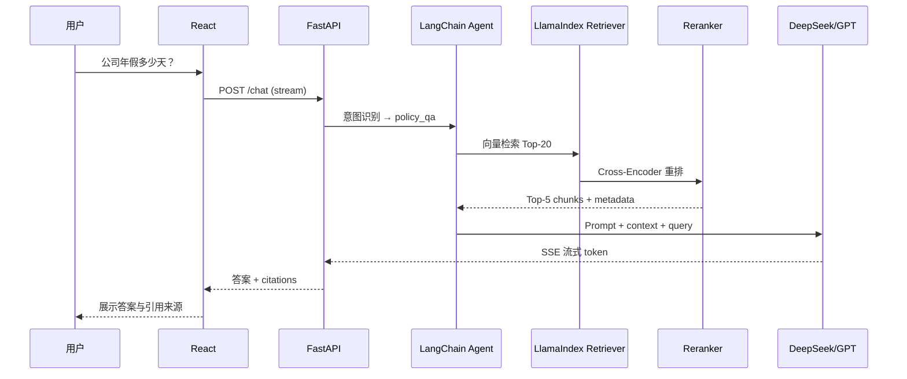

# AI Agent + RAG 企业知识库系统 — 技术分析文档

> 版本：v1.0  
> 日期：2026-06-19  
> 目标：面向招聘展示的全栈 AI 项目，覆盖 RAG、Agent、多模态文档解析、向量检索与重排序

---

## 1. 项目定位与招聘价值

### 1.1 一句话描述

基于 **FastAPI + React** 的企业内部知识库问答系统，支持 PDF/Word/PPT/Excel 上传，通过 **RAG（检索增强生成）** 回答制度类问题，通过 **AI Agent** 完成合同总结、风险条款提取、请假单生成等结构化任务。

### 1.2 为什么这个项目适合简历/面试

| 招聘关键词 | 本项目如何覆盖 |
|-----------|---------------|
| RAG | 文档切片、向量检索、重排序、引用溯源 |
| Agent | 多工具编排：检索、总结、抽取、填表生成 |
| LLM 工程 | DeepSeek / GPT 双模型、Prompt 模板、流式输出 |
| 向量数据库 | FAISS（本地）+ Chroma（持久化）双方案对比实现 |
| Embedding | BGE-M3 多语言稠密向量 + 稀疏检索能力 |
| 全栈 | FastAPI 后端 + React 前端 + 文件上传/对话 UI |
| 企业场景 | 制度问答、合同分析、合规风险、办公自动化 |

### 1.3 核心差异化（区别于「简单 ChatPDF」）

1. **多类型任务路由**：同一入口，根据意图自动选择 RAG 问答 / 全文总结 / 结构化抽取 / 表单生成。
2. **双框架并存**：LangChain 负责 Agent 编排，LlamaIndex 负责索引与检索管线——体现技术广度与选型思考。
3. **检索质量闭环**：BGE-M3 Embedding + Cross-Encoder Rerank，可量化对比「无 Rerank vs 有 Rerank」的命中率。
4. **企业文档适配**：Excel 表格、PPT 大纲、Word 合同条款的分块策略各不相同，不是一刀切 chunk。

---

## 2. 功能需求分析

### 2.1 文档上传与管理

| 格式 | 解析方案 | 难点 | 分块策略 |
|------|---------|------|---------|
| PDF | PyMuPDF / pdfplumber | 扫描件需 OCR（可选 PaddleOCR） | 按页 + 标题层级，保留页码元数据 |
| Word (.docx) | python-docx | 表格、编号列表 | 按 Heading 1/2/3 分段 |
| PPT (.pptx) | python-pptx | 每页信息密度低 | 每 Slide 一块，附演讲者备注 |
| Excel (.xlsx) | openpyxl / pandas | 多 Sheet、合并单元格 | 按 Sheet 转 Markdown 表格，大行集按行组切分 |

**元数据设计（每条 Chunk 必带）**

```json
{
  "doc_id": "uuid",
  "filename": "员工手册2024.pdf",
  "doc_type": "policy | contract | ppt | spreadsheet",
  "page": 12,
  "section": "第三章 休假制度",
  "chunk_index": 3,
  "uploaded_at": "2026-06-19T10:00:00Z",
  "department": "HR"
}
```

### 2.2 四类典型用户场景

#### 场景 A：制度问答（RAG）

> **用户**：公司年假多少天？

| 环节 | 说明 |
|------|------|
| 意图 | `policy_qa` — 事实型问答 |
| 流程 | Query 改写 → 向量检索 Top-K → Rerank Top-N → LLM 生成（强制引用来源） |
| 输出 | 答案 + 引用片段 + 文档名/页码 |
| 关键 | 回答必须带 `citations`，避免幻觉 |

#### 场景 B：合同总结（长文档理解）

> **用户**：总结这份合同内容

| 环节 | 说明 |
|------|------|
| 意图 | `document_summary` |
| 流程 | Map-Reduce 或 Refine 摘要；短合同可全文 + 结构化 Prompt |
| 输出 | 摘要（主体、期限、金额、关键义务）+ 章节大纲 |
| Agent 工具 | `get_document_full_text`, `summarize_section` |

#### 场景 C：风险条款提取（结构化抽取）

> **用户**：帮我提取所有风险条款

| 环节 | 说明 |
|------|------|
| 意图 | `risk_extraction` |
| 流程 | 分块遍历 + 每块 LLM 抽取 → 合并去重 → 风险等级标注 |
| 输出 | JSON 列表：`[{clause, risk_level, reason, location}]` |
| Agent 工具 | `search_contract`, `extract_risks`, `merge_results` |

#### 场景 D：请假申请生成（Agent + 制度检索）

> **用户**：根据制度生成请假申请

| 环节 | 说明 |
|------|------|
| 意图 | `form_generation` |
| 流程 | 检索请假制度 → 收集用户缺失字段（请假类型、日期、事由）→ 填充模板 |
| 输出 | 结构化请假单（可导出 Word/PDF） |
| Agent 工具 | `rag_search`, `ask_user`, `fill_template` |

### 2.3 功能清单（MVP → 完整版）

| 优先级 | 功能 | MVP | 完整版 |
|--------|------|-----|--------|
| P0 | 四格式上传与解析 | ✅ | ✅ |
| P0 | 向量入库与检索 | ✅ | ✅ |
| P0 | 对话问答（流式） | ✅ | ✅ |
| P0 | 引用溯源 | ✅ | ✅ |
| P1 | 意图识别 + Agent 路由 | 规则路由 | LLM Router |
| P1 | 合同总结 | ✅ | 多文档对比总结 |
| P1 | 风险条款提取 | ✅ | 风险等级 + 修改建议 |
| P2 | 请假单生成 | ✅ | 对接 OA _mock API |
| P2 | Rerank 对比面板 | — | ✅ |
| P3 | 用户/权限/多租户 | — | ✅ |
| P3 | OCR 扫描件 | — | ✅ |

---

## 3. 系统架构

### 3.1 总体架构图

```
┌─────────────────────────────────────────────────────────────────┐
│                        React 前端                                │
│  文档上传 │ 知识库管理 │ 对话窗口 │ 任务面板（总结/抽取/填表）      │
└────────────────────────────┬────────────────────────────────────┘
                             │ REST / SSE
┌────────────────────────────▼────────────────────────────────────┐
│                     FastAPI 网关层                               │
│  /upload  /chat  /documents  /tasks  /health                      │
└────────────────────────────┬────────────────────────────────────┘
                             │
        ┌────────────────────┼────────────────────┐
        ▼                    ▼                    ▼
┌───────────────┐   ┌───────────────┐   ┌───────────────┐
│ 文档解析服务   │   │  Agent 编排层  │   │  向量检索服务  │
│ Parser Pipeline│   │  LangChain    │   │  LlamaIndex   │
│ PDF/DOC/PPT/XLS│   │  Router+Tools │   │  + Rerank     │
└───────┬───────┘   └───────┬───────┘   └───────┬───────┘
        │                   │                   │
        ▼                   ▼                   ▼
┌───────────────┐   ┌───────────────┐   ┌───────────────┐
│ 原始文件存储   │   │  LLM 服务层    │   │ 向量存储       │
│ ./data/files  │   │ DeepSeek/GPT  │   │ FAISS / Chroma │
└───────────────┘   └───────────────┘   └───────────────┘
        │                                       │
        ▼                                       ▼
┌───────────────┐                       ┌───────────────┐
│ SQLite/PG     │                       │ BGE-M3        │
│ 文档元数据     │                       │ Embedding     │
└───────────────┘                       └───────────────┘
```

### 3.2 请求处理时序（制度问答）



### 3.3 文档入库流水线

```
上传文件
  → 格式识别 (magic + extension)
  → 对应 Parser 解析为纯文本/Markdown
  → 文本清洗（去页眉页脚、多余空白）
  → 智能分块 (Chunk Size 512, Overlap 64，按文档类型调整)
  → BGE-M3 向量化
  → 写入 Chroma（持久化）+ 同步 FAISS 索引（快速实验）
  → 元数据写入 SQLite
```

---

## 4. 技术栈选型分析

### 4.1 后端：FastAPI

**选择理由**

- 原生 async，适合 LLM 流式响应（SSE）
- Pydantic 模型与 OpenAPI 文档自动生成，前后端协作友好
- Python 生态与 LangChain / LlamaIndex 无缝集成

**核心依赖**

```
fastapi, uvicorn, python-multipart
langchain, langchain-openai, langchain-community
llama-index, llama-index-vector-stores-chroma
chromadb, faiss-cpu
sentence-transformers  # BGE-M3
FlagEmbedding          # BGE Reranker
pymupdf, python-docx, python-pptx, openpyxl
sqlalchemy, aiosqlite
```

### 4.2 前端：React

**选择理由**

- 组件化适合：上传区、对话气泡、引用卡片、任务结果表格
- 生态成熟：Ant Design / shadcn/ui + React Query

**核心页面**

| 页面 | 功能 |
|------|------|
| `/` | 对话主界面（支持多会话） |
| `/documents` | 文档列表、删除、重新索引 |
| `/upload` | 拖拽上传四格式文件 |
| `/tasks` | 合同总结 / 风险抽取 / 请假单历史 |

### 4.3 LangChain vs LlamaIndex — 分工而非二选一

| 维度 | LangChain | LlamaIndex | 本项目分工 |
|------|-----------|------------|-----------|
| 强项 | Agent、Tool、Chain 编排 | 索引、检索、Query Engine | **LangChain = Agent 层** |
| 检索 | 有，但非核心 | 核心能力，开箱即用 | **LlamaIndex = RAG 管线** |
| 学习曲线 | 抽象多，灵活 | 索引概念清晰 | 各取所长 |
| 面试话术 | 「我用 LC 做 Agent 路由和 Tool Calling」 | 「我用 LI 管理 VectorStoreIndex 和 Retriever」 | 体现选型能力 |

**推荐集成方式**

```python
# LlamaIndex 负责：建索引、检索
retriever = index.as_retriever(similarity_top_k=20)

# LangChain 负责：把 retriever 包装成 Tool
@tool
def search_knowledge_base(query: str) -> str:
  nodes = retriever.retrieve(query)
  return format_nodes(nodes)

# Agent 根据意图调用不同 tools
agent = create_tool_calling_agent(llm, tools=[search_knowledge_base, summarize_doc, extract_risks, generate_leave_form])
```

### 4.4 FAISS vs Chroma

| 维度 | FAISS | Chroma |
|------|-------|--------|
| 类型 | 向量索引库（库） | 向量数据库（带持久化） |
| 持久化 | 需手动 save/load | 内置 SQLite 持久化 |
| 元数据过滤 | 较弱（需自己维护） | 原生支持 where 过滤 |
| 适用场景 | 原型、离线实验、百万级纯向量 | 生产、需要 metadata filter |
| 内存 | 极快，全内存 | 适中 |

**本项目策略：双实现，可配置切换**

```yaml
# config.yaml
vector_store:
  provider: chroma  # faiss | chroma
  chroma:
    persist_dir: ./data/chroma
  faiss:
    index_path: ./data/faiss/index.bin
```

面试可讲：**开发阶段用 FAISS 快速验证召回率，部署用 Chroma 支持元数据过滤（如只搜 HR 制度类文档）。**

### 4.5 Embedding：BGE-M3

**选择理由**

- 多语言（中英混合企业文档场景）
- 支持 Dense + Sparse + Multi-vector（可选 Hybrid Search）
- MTEB 榜单表现优秀，可本地部署，无 API 费用
- 维度 1024，与主流向量库兼容

**部署方式**

```python
from FlagEmbedding import BGEM3FlagModel

model = BGEM3FlagModel("BAAI/bge-m3", use_fp16=True)
embeddings = model.encode(texts, batch_size=12)["dense_vecs"]
```

**注意事项**

- 首次需下载约 2.3GB 模型，README 中说明 `huggingface-cli download`
- CPU 推理较慢，有 GPU 可显著加速；MVP 可接受

### 4.6 Rerank（重排序）

**为什么需要**

向量检索（Bi-Encoder）召回率高但精度有限；Rerank（Cross-Encoder）对 Query-Doc 对做精细打分，显著提升 Top-5 质量。

**推荐模型**

| 模型 | 说明 |
|------|------|
| BAAI/bge-reranker-v2-m3 | 与 BGE-M3 同系列，中英友好 |
| BAAI/bge-reranker-large | 效果更好，略慢 |

**流程**

```
Query → Embedding 检索 Top-20 → Rerank → 取 Top-5 → 送入 LLM
```

**可量化指标（面试加分）**

- Hit@5：无 Rerank vs 有 Rerank
- MRR（Mean Reciprocal Rank）
- 可用 20 条人工标注问答对做评测脚本

### 4.7 LLM：DeepSeek + GPT 双通道

| 模型 | 用途 | 优势 |
|------|------|------|
| DeepSeek-V3 / deepseek-chat | 默认对话、总结、抽取 | 性价比高，中文好 |
| GPT-4o / gpt-4o-mini | 复杂合同分析、英文文档 | 推理能力强，面试官熟悉 |

**抽象层设计**

```python
class LLMProvider(Protocol):
    async def astream(self, messages: list) -> AsyncIterator[str]: ...
    async def ainvoke(self, messages: list) -> str: ...

# 通过环境变量切换
LLM_PROVIDER=deepseek  # openai
```

**成本估算（MVP 演示）**

- 单次 RAG 问答约 2K-4K tokens
- DeepSeek 成本极低，适合开发调试
- GPT 用于对比评测和质量兜底

---

## 5. Agent 设计

### 5.1 意图路由

**MVP：规则 + 关键词**

```python
INTENT_RULES = {
    "policy_qa": ["多少", "制度", "规定", "流程", "怎么申请"],
    "document_summary": ["总结", "概括", "摘要", "梳理"],
    "risk_extraction": ["风险", "条款", "陷阱", "不利"],
    "form_generation": ["生成", "请假", "申请", "填写"],
}
```

**完整版：LLM Router**

```python
router_prompt = """
根据用户问题，选择唯一意图：
- policy_qa: 制度/政策类事实问答
- document_summary: 文档总结
- risk_extraction: 风险条款抽取
- form_generation: 表单/申请生成
只返回 JSON: {"intent": "...", "confidence": 0.95}
"""
```

### 5.2 Tool 清单

| Tool 名称 | 职责 | 使用场景 |
|-----------|------|---------|
| `search_knowledge_base` | RAG 向量检索 + Rerank | 制度问答 |
| `get_document_by_id` | 获取指定文档全文 | 总结、抽取 |
| `summarize_text` | 调用 LLM 做分段摘要 | 合同总结 |
| `extract_structured` | 结构化 JSON 抽取 | 风险条款 |
| `get_policy_template` | 获取请假单模板 | 表单生成 |
| `ask_clarification` | 向用户追问缺失信息 | 请假单缺日期 |

### 5.3 各场景 Agent 流程

#### policy_qa

```
Router → search_knowledge_base → 组装 Prompt（含 citations 约束）→ 流式回答
```

#### document_summary

```
Router → 确认目标文档 → get_document_by_id
  → 若 len > 8000 tokens: Map-Reduce 分块摘要再合并
  → 否则: 单次结构化摘要
```

#### risk_extraction

```
Router → get_document_by_id → 按章节分块
  → 每块 extract_structured(prompt=风险抽取模板)
  → merge + deduplicate → 返回 JSON + 高亮位置
```

#### form_generation

```
Router → search_knowledge_base("请假 制度 流程")
  → 检查用户是否提供：类型、起止日期、事由
  → 缺失则 ask_clarification
  → get_policy_template → LLM 填充 → 返回 Markdown/Word
```

### 5.4 Prompt 设计要点

**RAG 问答 System Prompt（防幻觉）**

```
你是企业知识库助手。仅根据【检索上下文】回答问题。
规则：
1. 上下文无相关信息时，明确说「未在知识库中找到」，不要编造。
2. 回答末尾用 [来源: 文件名, 第X页] 标注引用。
3. 数值类问题（如年假天数）必须引用原文。
```

**风险抽取 Prompt**

```
从以下合同片段中提取可能对甲方不利的条款。
输出 JSON 数组，每项包含：
- clause: 原文
- risk_level: high|medium|low
- category: 违约|知识产权|保密|付款|终止|其他
- suggestion: 修改建议（一句话）
无风险则返回 []
```

---

## 6. API 设计

### 6.1 核心接口

| 方法 | 路径 | 说明 |
|------|------|------|
| POST | `/api/v1/documents/upload` | 上传文档，触发解析入库 |
| GET | `/api/v1/documents` | 文档列表 |
| DELETE | `/api/v1/documents/{id}` | 删除文档及向量 |
| POST | `/api/v1/chat` | 对话（SSE 流式） |
| POST | `/api/v1/tasks/summary` | 合同总结任务 |
| POST | `/api/v1/tasks/risk-extract` | 风险抽取任务 |
| POST | `/api/v1/tasks/leave-form` | 请假单生成 |
| GET | `/api/v1/health` | 健康检查 |

### 6.2 对话请求/响应示例

**请求**

```json
{
  "message": "公司年假多少天？",
  "session_id": "uuid",
  "doc_ids": [],
  "stream": true
}
```

**SSE 事件**

```
event: token
data: {"content": "根据"}

event: citation
data: {"sources": [{"doc": "员工手册.pdf", "page": 15, "text": "..."}]}

event: done
data: {"session_id": "uuid"}
```

---

## 7. 数据库设计

### 7.1 关系型（SQLite / PostgreSQL）

```sql
-- 文档表
CREATE TABLE documents (
    id          TEXT PRIMARY KEY,
    filename    TEXT NOT NULL,
    doc_type    TEXT NOT NULL,  -- pdf|docx|pptx|xlsx
    category    TEXT,             -- policy|contract|other
    file_path   TEXT NOT NULL,
    chunk_count INTEGER DEFAULT 0,
    status      TEXT DEFAULT 'processing',  -- processing|ready|failed
    created_at  TIMESTAMP DEFAULT CURRENT_TIMESTAMP
);

-- 会话表
CREATE TABLE chat_sessions (
    id          TEXT PRIMARY KEY,
    title       TEXT,
    created_at  TIMESTAMP DEFAULT CURRENT_TIMESTAMP
);

-- 消息表
CREATE TABLE chat_messages (
    id          TEXT PRIMARY KEY,
    session_id  TEXT REFERENCES chat_sessions(id),
    role        TEXT NOT NULL,  -- user|assistant
    content     TEXT NOT NULL,
    citations   JSON,
    intent      TEXT,
    created_at  TIMESTAMP DEFAULT CURRENT_TIMESTAMP
);

-- 任务表（总结/抽取/填表）
CREATE TABLE tasks (
    id          TEXT PRIMARY KEY,
    task_type   TEXT NOT NULL,
    doc_id      TEXT REFERENCES documents(id),
    input       JSON,
    output      JSON,
    status      TEXT DEFAULT 'pending',
    created_at  TIMESTAMP DEFAULT CURRENT_TIMESTAMP
);
```

### 7.2 向量库（Chroma Collection）

```
Collection: enterprise_kb
  - id: chunk_uuid
  - embedding: float[1024]
  - document: chunk_text
  - metadata: {doc_id, filename, page, section, doc_type}
```

---

## 8. 项目目录结构（建议）

```
enterprise-kb/
├── backend/
│   ├── app/
│   │   ├── main.py                 # FastAPI 入口
│   │   ├── api/
│   │   │   ├── documents.py
│   │   │   ├── chat.py
│   │   │   └── tasks.py
│   │   ├── core/
│   │   │   ├── config.py
│   │   │   └── llm.py              # DeepSeek/GPT 抽象
│   │   ├── parsers/                # 四格式解析器
│   │   │   ├── pdf_parser.py
│   │   │   ├── docx_parser.py
│   │   │   ├── pptx_parser.py
│   │   │   └── xlsx_parser.py
│   │   ├── rag/
│   │   │   ├── embeddings.py       # BGE-M3
│   │   │   ├── indexer.py          # LlamaIndex 建索引
│   │   │   ├── retriever.py        # 检索 + Rerank
│   │   │   └── chunking.py         # 分块策略
│   │   ├── agents/
│   │   │   ├── router.py           # 意图路由
│   │   │   ├── tools.py            # LangChain Tools
│   │   │   └── prompts.py
│   │   ├── models/                 # SQLAlchemy ORM
│   │   └── schemas/                # Pydantic
│   ├── requirements.txt
│   └── .env.example
├── frontend/
│   ├── src/
│   │   ├── pages/
│   │   ├── components/
│   │   │   ├── ChatWindow.tsx
│   │   │   ├── FileUpload.tsx
│   │   │   ├── CitationCard.tsx
│   │   │   └── TaskResult.tsx
│   │   └── api/
│   ├── package.json
│   └── vite.config.ts
├── data/
│   ├── files/                      # 原始上传文件
│   ├── chroma/                       # Chroma 持久化
│   └── faiss/                        # FAISS 索引
├── docs/
│   ├── ANALYSIS.md                 # 本文档
│   └── ROADMAP.md
├── scripts/
│   ├── seed_demo_docs.py           # 演示数据
│   └── eval_retrieval.py           # RAG 评测脚本
├── docker-compose.yml
└── README.md
```

---

## 9. 开发路线图

### Phase 1：基础 RAG（1-2 周）

- [ ] FastAPI 项目骨架 + 配置管理
- [ ] PDF/DOCX 解析 + 分块 + BGE-M3 向量化
- [ ] Chroma 入库与检索
- [ ] 基础 `/chat` 接口（无 Agent，纯 RAG）
- [ ] React 对话页 + 文件上传

**里程碑**：能上传员工手册 PDF，问「年假多少天」并返回答案+引用。

### Phase 2：Agent + 多格式（1-2 周）

- [ ] 接入 LangChain Agent + 意图路由
- [ ] PPT/Excel 解析器
- [ ] Rerank 集成
- [ ] 合同总结、风险抽取 API
- [ ] 前端任务面板

**里程碑**：四类场景全部可演示。

### Phase 3：打磨与招聘包装（1 周）

- [ ] FAISS 双实现 + 配置切换
- [ ] DeepSeek / GPT 双 LLM 切换
- [ ] 检索评测脚本 + README 指标
- [ ] Docker Compose 一键启动
- [ ] 演示视频 + 示例文档包

---

## 10. 风险与挑战

| 风险 | 影响 | 缓解措施 |
|------|------|---------|
| BGE-M3 模型大、CPU 慢 | 首次入库慢 | 批量 encode；可选 API Embedding 降级 |
| 合同类长文档超上下文 | 总结/抽取质量差 | Map-Reduce；按章节处理 |
| LLM 幻觉 | 错误制度答案 | 强制 citations；低置信度拒答 |
| 扫描版 PDF | 解析为空 | 提示用户；Phase 3 加 OCR |
| Excel 复杂表格 | 结构丢失 | 转 Markdown 表格；按 Sheet 分块 |
| 双框架学习成本 | 开发周期拉长 | 明确分工：LI=RAG, LC=Agent |

---

## 11. 面试话术准备

### 「介绍一下这个项目」

> 我做了一个企业知识库 RAG + Agent 系统。用户可上传 PDF、Word、PPT、Excel，系统用 BGE-M3 做向量化，Chroma 持久化存储，检索时用 Cross-Encoder Rerank 提升精度。上层用 LangChain Agent 做意图路由，能处理制度问答、合同总结、风险条款抽取和请假单生成四类任务。LLM 层抽象了 DeepSeek 和 GPT，可按场景切换。

### 「为什么同时用 LangChain 和 LlamaIndex？」

> LlamaIndex 擅长索引和检索管线，API 更贴合 RAG 场景；LangChain 的 Agent 和 Tool 编排更成熟。我让它们各司其职，通过把 LlamaIndex Retriever 包装成 LangChain Tool 来集成。

### 「如何评估 RAG 效果？」

> 我准备了 20 条标注问答对，对比了有/无 Rerank 的 Hit@5 和 MRR，并在 README 里贴了结果。同时要求模型输出必须带引用来源，方便人工抽检幻觉率。

### 「遇到过什么难点？」

> 合同文档很长，直接塞给 LLM 会超上下文。我用 Map-Reduce 分块摘要，风险抽取则按章节并行调用再合并去重。Excel 表格我转成 Markdown 格式分块，避免行列关系丢失。

---

## 12. 环境变量清单

```bash
# LLM
LLM_PROVIDER=deepseek          # deepseek | openai
DEEPSEEK_API_KEY=sk-xxx
OPENAI_API_KEY=sk-xxx
DEEPSEEK_BASE_URL=https://api.deepseek.com/v1

# Embedding（本地模型无需 Key）
EMBEDDING_MODEL=BAAI/bge-m3
RERANK_MODEL=BAAI/bge-reranker-v2-m3

# Vector Store
VECTOR_STORE=chroma            # chroma | faiss
CHROMA_PERSIST_DIR=./data/chroma

# App
DATABASE_URL=sqlite+aiosqlite:///./data/app.db
UPLOAD_DIR=./data/files
CORS_ORIGINS=http://localhost:5173
```

---

## 13. 下一步行动

1. **确认范围**：是否按 MVP（Phase 1+2）先实现，OCR/多租户放到 Phase 3？
2. **确认 LLM**：开发期默认 DeepSeek，是否需要有 OpenAI Key 做对比？
3. **示例数据**：是否需要我准备一套演示文档（员工手册、劳动合同、请假制度 Excel）？
4. **开始编码**：确认后从 `backend` 骨架 + PDF 解析 + Chroma RAG 链路开工。

---

## 附录 A：演示文档建议

| 文件 | 类型 | 用途 |
|------|------|------|
| 员工手册2024.pdf | policy | 年假/考勤问答 |
| 劳动合同模板.docx | contract | 总结 + 风险抽取 |
| 公司制度培训.pptx | ppt | 多格式解析展示 |
| 请假记录表.xlsx | spreadsheet | 制度数据引用 |

## 附录 B：关键技术指标（目标值）

| 指标 | 目标 |
|------|------|
| 单文档入库（50页 PDF） | < 60s（CPU） |
| 问答首 token 延迟 | < 2s |
| Rerank 后 Hit@5 提升 | > 15% vs 无 Rerank |
| 四格式解析成功率 | > 95%（非扫描件） |
